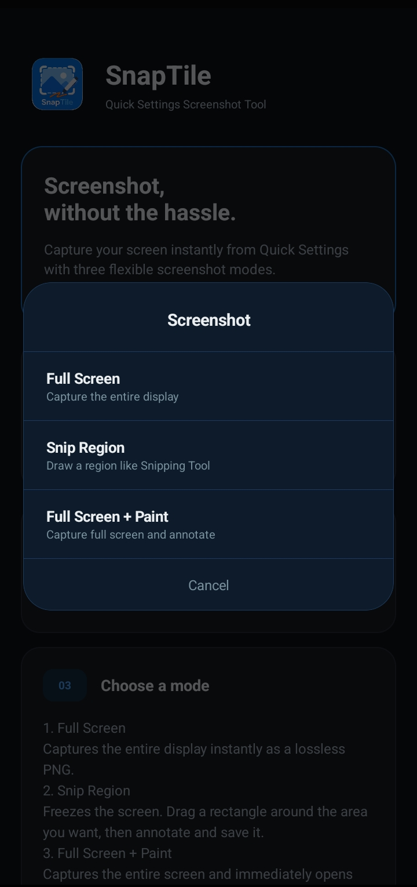
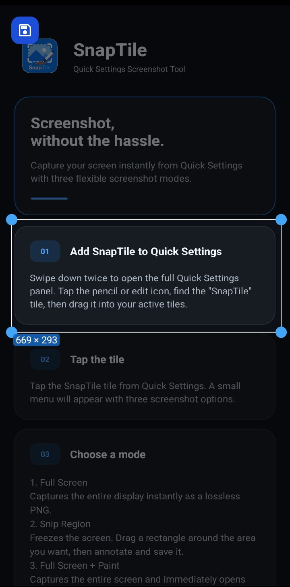
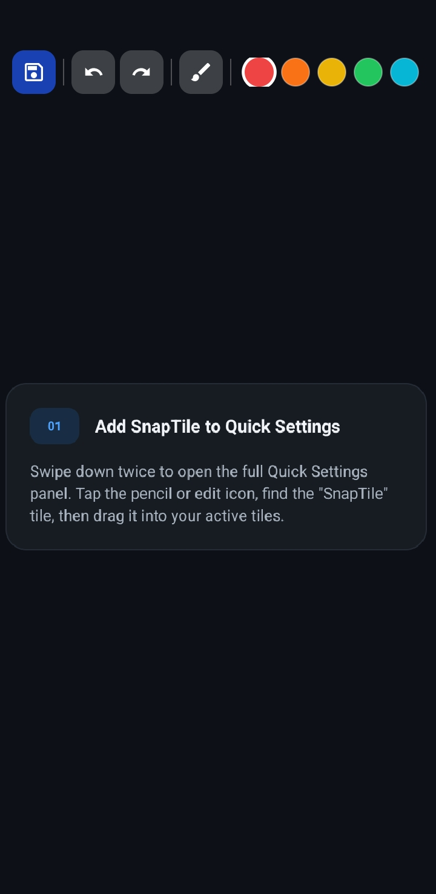

# SnapTile

**Lightweight screenshot and snipping tool for Android.**  
*Capture your screen from Quick Settings, select a region, annotate it, and save it as a lossless PNG.*

[](LICENSE)
[](https://android.com)
[]()
[]()

<p align="center">
  <a href="https://github.com/hashierholmes/SnapTile/releases/latest">
    
  </a>
</p>

---

## Overview

**SnapTile** is a lightweight Android screenshot utility built around the system Quick Settings panel.

It provides three capture modes:

- **Full Screen** — captures the entire display and saves it as a lossless PNG.
- **Snip Region** — captures the display, allows the user to select a specific region, and opens the paint editor.
- **Full Screen + Paint** — captures the entire display and opens the paint editor immediately.

The project uses Android's native `MediaProjection` APIs for screen capture and keeps the entire image-processing pipeline local to the device.

SnapTile does not require a backend, network connection, account, or third-party service.

---

## Screenshots

<p align="center">
  
  &nbsp;&nbsp;
  
  &nbsp;&nbsp;
  
</p>

---

## Features

- **Quick Settings Integration** — Launch screenshot capture directly from Android Quick Settings.
- **Full Screen Capture** — Capture the entire display as a lossless PNG.
- **Interactive Snipping Tool** — Select, move, resize, or replace a screenshot region before editing.
- **Paint Annotation** — Draw directly over captured screenshots using configurable brush sizes and colors.
- **Undo / Redo** — Reverse or restore individual paint strokes without modifying the original bitmap.
- **Multiple Capture Modes** — Choose between full-screen capture, region selection, or full-screen capture with immediate editing.
- **Native Android Implementation** — Built primarily with Android framework APIs and Java.
- **Lossless PNG Output** — Screenshots are saved as PNG files to preserve image quality.
- **Native MediaStore Support** — Uses Android's modern shared-media APIs on supported Android versions.
- **Offline Operation** — Core screenshot and editing functionality does not require network access.
- **Minimal Permissions** — SnapTile does not request unnecessary network or account-related permissions.

---

## Architecture

```text
[ Android Quick Settings ]
            │
            ▼
[ ScreenshotTileService ]
            │
            ▼
[ ScreenshotChooserActivity ]
            │
       Capture Mode
            │
            ▼
[ CaptureActivity ]
            │
     MediaProjection
       Authorization
            │
            ▼
[ ProjectionService ]
            │
    Foreground Service
            │
            ▼
[ VirtualDisplay + ImageReader ]
            │
       Single Frame
            │
            ▼
         [ Bitmap ]
            │
      ┌─────┼───────────────┐
      │     │               │
      ▼     ▼               ▼
 Full Screen │        Full + Paint
      │     │               │
      │     ▼               │
      │ [ SnipActivity ] ◄──┘
      │     │
      │     ├─ Region Selection
      │     │
      │     └─ Paint Editor
      │
      └──────────┬────────────┘
                 ▼
          [ ImageSaver ]
                 │
                 ▼
      Pictures/Screenshots/
```

---

## Components

| Component | Responsibility |
| :--- | :--- |
| `MainActivity` | Provides the launcher/setup screen and developer credit. |
| `ScreenshotTileService` | Exposes SnapTile through Android Quick Settings. |
| `ScreenshotChooserActivity` | Allows the user to select the desired capture mode. |
| `CaptureActivity` | Handles MediaProjection authorization, screen capture, bitmap creation, and capture-mode routing. |
| `ProjectionService` | Provides the short-lived foreground service required while MediaProjection is active. |
| `SnipActivity` | Provides region selection and the current screenshot paint editor. |
| `ImageSaver` | Writes captured or edited screenshots to shared storage as PNG files. |
| `PaintToolbar` | Standalone drawing-toolbar helper kept separate from the current `SnipActivity` editor implementation. |

---

## Project Structure

```text
src/main/
├── AndroidManifest.xml
├── java/
│   └── com/snaptile/app/
│       ├── CaptureActivity.java
│       ├── ImageSaver.java
│       ├── MainActivity.java
│       ├── PaintToolbar.java
│       ├── ProjectionService.java
│       ├── ScreenshotChooserActivity.java
│       ├── ScreenshotTileService.java
│       └── SnipActivity.java
└── res/
    ├── drawable/
    ├── layout/
    ├── mipmap-*/
    └── values/
```

---

## Android APIs

SnapTile relies primarily on native Android framework APIs:

- `MediaProjection` — obtains the user's explicit authorization for screen capture.
- `VirtualDisplay` — mirrors the device display into an `ImageReader`.
- `ImageReader` — receives individual display frames from the virtual display.
- `Image` / `Plane` — provides access to the raw captured pixel buffer.
- `Bitmap` — stores captured frames and provides the base image for editing.
- `Canvas` — renders screenshot content and annotation strokes.
- `Path` — records individual drawing strokes for reversible editing.
- `Paint` — stores brush appearance and rendering properties.
- `TileService` — integrates SnapTile with Android Quick Settings.
- `Service` — provides the foreground-service execution required during screen projection.
- `MediaStore` — stores screenshots in the system's shared media collection on modern Android versions.
- `ContentResolver` — writes screenshot data through Android's storage APIs.

---

## Permissions

| Permission | Purpose |
| :--- | :--- |
| `android.permission.FOREGROUND_SERVICE` | Allows the capture service to run as a foreground service. |
| `android.permission.FOREGROUND_SERVICE_MEDIA_PROJECTION` | Required for foreground services using MediaProjection on supported Android versions. |

SnapTile does **not** require the `INTERNET` permission.

Screen capture itself also requires explicit authorization through Android's `MediaProjection` consent dialog.

---

## Requirements

- Android device running **Android 5.0 (API 21)** or higher.
- Android SDK and Gradle.
- [Android Studio](https://developer.android.com/studio) or [AndroidIDE](https://androidide.com/).
- A device or emulator that supports the required Android screen-capture APIs.

No API key, backend server, account, or internet connection is required.

---

## Configuration & Usage

### Initial Setup

1. Install the SnapTile APK.
2. Open **SnapTile** once to access the setup screen.
3. Open the Android Quick Settings panel.
4. Tap the **Edit** / pencil button.
5. Find **SnapTile** in the available tiles.
6. Drag the tile into the active Quick Settings area.

The first capture requires Android's **MediaProjection** screen-capture authorization.

This permission is controlled by Android and cannot be silently granted by SnapTile.

---

## Build

Clone the repository:

```bash
git clone https://github.com/hashierholmes/SnapTile.git
cd SnapTile
```

Open the project in Android Studio or AndroidIDE.

Build the debug APK:

```bash
./gradlew assembleDebug
```

The generated APK should be located at:

```text
app/build/outputs/apk/debug/app-debug.apk
```

Install it through ADB:

```bash
adb install app/build/outputs/apk/debug/app-debug.apk
```

---

## Release Build & Signing

For release builds, use your own local signing configuration rather than committing private signing credentials to the repository.

If the project uses a local `keystore.properties` configuration, keep that file outside version control.

Example:

```properties
STORE_FILE=path/to/your/keystore.jks
STORE_PASSWORD=your_store_password
KEY_ALIAS=your_key_alias
KEY_PASSWORD=your_key_password
```

Add the following to `.gitignore`:

```gitignore
keystore.properties
*.jks
*.keystore
```

Never commit:

- Keystore files
- Keystore passwords
- Key aliases intended to remain private
- Release signing credentials

Official releases should be signed using the maintainer's release key, while developers building their own releases should use their own signing credentials.

---

## Development & Feedback

SnapTile is primarily maintained by its author.

The project does not currently accept direct code contributions or pull requests. This allows the project to maintain a consistent architecture, implementation style, design direction, and dependency philosophy.

Bug reports, suggestions, and feature requests are still welcome through the repository's issue tracker.

Feedback may be reviewed and incorporated at the author's discretion.

Please avoid submitting pull requests unless specifically requested.

---

## Privacy

SnapTile is designed to operate locally on the device.

- No ads
- No analytics
- No tracking
- No account system
- No screenshot uploads
- No backend server
- No API keys
- No `INTERNET` permission
- Screenshots remain on the device unless the user chooses to share them

MediaProjection is used only when the user explicitly starts a capture and grants Android's system screen-capture permission.

---

## License

SnapTile's source code is licensed under the **MIT License**.

You are free to use, copy, modify, distribute, sublicense, and commercially use the source code in accordance with the terms of the MIT License.

The **SnapTile name, logo, branding, visual identity, screenshots, and other project identifiers are not licensed under the MIT License** unless explicitly stated otherwise.

The MIT License applies to the source code only and does not grant permission to use SnapTile's branding or represent a fork or derivative work as the official SnapTile project.

Forks and derivative works are permitted under the MIT License, including commercial distribution, but should use their own name, logo, and branding.

See [`LICENSE`](LICENSE) for the complete license text.

---

## Disclaimer

SnapTile uses Android's official screen-capture mechanisms.

Screen capture is subject to the security and permission restrictions enforced by the Android operating system. SnapTile cannot bypass Android's MediaProjection consent requirements.